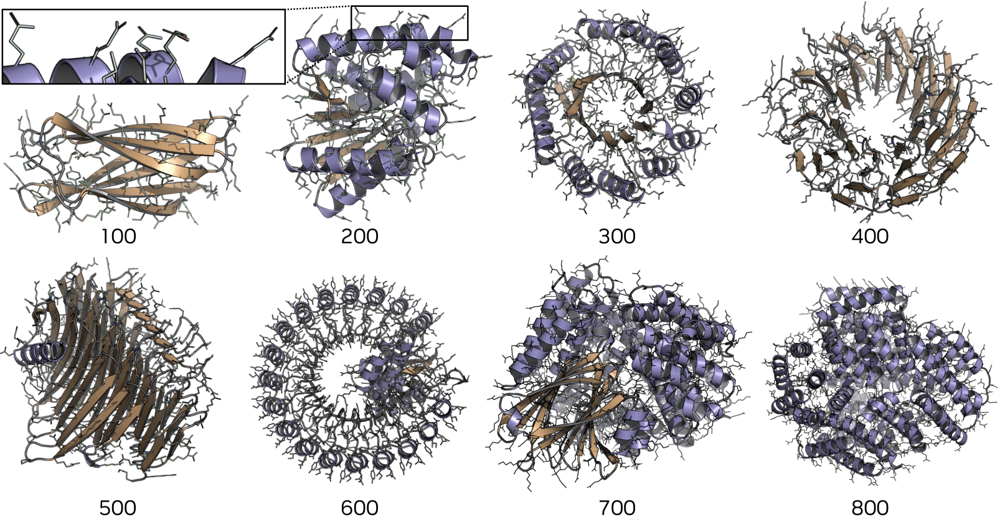

# La-Proteina: Atomistic Protein Generation via Partially Latent Flow Matching

<div align="center">
  <a href="https://tomasgeffner.github.io/" target="_blank">Tomas&nbsp;Geffner<sup>*</sup></a> &emsp; <b>&middot;</b> &emsp;
  <a href="https://kdidi.netlify.app/" target="_blank">Kieran&nbsp;Didi<sup>*</sup></a> &emsp; <b>&middot;</b> &emsp;
  <a href="https://scholar.google.com/citations?hl=en&user=wGjVFHIAAAAJ&view_op=list_works&sortby=pubdate" target="_blank">Zhonglin&nbsp;Cao</a> &emsp; <b>&middot;</b> &emsp;
  <a href="https://scholar.google.com/citations?user=KBn52kYAAAAJ&hl=en" target="_blank">Danny&nbsp;Reidenbach</a> &emsp; <b>&middot;</b> &emsp;
  <a href="https://oxer11.github.io/" target="_blank">Zuobai&nbsp;Zhang</a>
  <br>
  <a href="https://christian.dallago.us/" target="_blank">Christian&nbsp;Dallago</a>  &emsp; <b>&middot;</b> &emsp;
  <a href="https://scholar.google.ch/citations?hl=en&user=LUXL9FoAAAAJ" target="_blank">Emine&nbsp;Kucukbenli</a> &emsp; <b>&middot;</b> &emsp;
  <a href="https://karstenkreis.github.io/" target="_blank">Karsten&nbsp;Kreis<sup>^</sup></a> &emsp; <b>&middot;</b> &emsp;
  <a href="http://latentspace.cc/" target="_blank">Arash&nbsp;Vahdat<sup>^</sup></a>
  <br> <br>
  <a href="https://arxiv.org/abs/2507.09466" target="_blank">Link&nbsp;to&nbsp;paper</a> &emsp; <b>&middot;</b> &emsp;
  <a href="https://research.nvidia.com/labs/genair/la-proteina/" target="_blank">Project&nbsp;Page</a>
  <br> <br>
  <span><sup>*</sup>equal contribution &emsp; <sup>^</sup>equal advising</span>
</div>

<br>
<br>

<div align="center">
    
</div>

<br>
<br>

*Abstract.* Recently, many generative models for de novo protein structure design have emerged. Yet, only few tackle the difficult task of directly generating fully atomistic structures jointly with the underlying amino acid sequence. This is challenging, for instance, because the model must reason over side chains that change in length during generation. We introduce La-Proteina for atomistic protein design based on a novel partially latent protein representation: coarse backbone structure is modeled explicitly, while sequence and atomistic details are captured via per-residue latent variables of fixed dimensionality, thereby effectively side-stepping challenges of explicit side-chain representations. Flow matching in this partially latent space then models the joint distribution over sequences and full-atom structures. La-Proteina achieves state-of-the-art performance on multiple generation benchmarks, including all-atom co-designability, diversity, and structural validity, as confirmed through detailed structural analyses and evaluations. Notably, La-Proteina also surpasses previous models in atomistic motif scaffolding performance, unlocking critical atomistic structure-conditioned protein design tasks. Moreover, La-Proteina is able to generate co-designable proteins of up to 800 residues, a regime where most baselines collapse and fail to produce valid samples, demonstrating La-Proteina's scalability and robustness.

Find the Model Card++ for La-Proteina [here](./modelcard/model_card_overview.md).

## Setup

For environment setup [mamba](https://mamba.readthedocs.io/en/latest/user_guide/mamba.html) or [micromamba](https://mamba.readthedocs.io/en/latest/user_guide/micromamba.html) is recommended, but alternatively conda can also be used as a drop-in replacement (substitute `mamba` with `conda`).

```
mamba env create -f environment.yaml
mamba activate laproteina_env
pip install torch==2.7.0 --index-url https://download.pytorch.org/whl/cu118
pip install graphein==1.7.7 --no-deps
pip install torch_geometric torch_scatter torch_sparse torch_cluster -f https://data.pyg.org/whl/torch-2.7.0+cu118.html
```

Please download all model checkpoints into the `./checkpoints_laproteina` directory, as indicated in the [Checkpoints](#checkpoints) section, which is necessary to sample our models.

If you are only interested in sampling our models, please go to [Sampling our models](#sampling).

To train models and use our minimal dataloaders, create a file `.env` in the root directory of the repo with the single line

```
DATA_PATH=/directory/where/you/want/dataset
```

In the paper we train our models on subsets of the AFDB. We provide lists of IDs for each dataset in [laproteina_afdb_ids.zip](https://catalog.ngc.nvidia.com/orgs/nvidia/teams/clara/resources/la_proteina_afdb_ids.zip/files).

## Dataloaders

We provide minimal dataloader implementations that allow training on different subsets of the PDB. Here we describe how to use these minimal dataloaders. Note that all our models are trained on subsets of the AFDB, not on the PDB, as described in the paper. We provide the indices of the AFDB used for the datasets described in the paper [here](https://catalog.ngc.nvidia.com/orgs/nvidia/teams/clara/resources/la_proteina_afdb_ids.zip/files).

### PDB dataloader

To use the PDB dataloader, you can for example use the `pdb_train_ucond.yaml` file, which we provide as part of our `configs/dataset/pdb` directory, in the following way:

```
import os
import hydra
import lightning as L

L.seed_everything(43)
version_base = hydra.__version__
config_path = </path/to/datasets_configs>
hydra.initialize_config_dir(config_dir=f"{config_path}/pdb", version_base=version_base)

cfg = hydra.compose(
    config_name="pdb_train",
    return_hydra_config=True,
)
pdb_datamodule = hydra.utils.instantiate(cfg.datamodule)
pdb_datamodule.prepare_data()
pdb_datamodule.setup("fit")
pdb_train_dataloader = pdb_datamodule.train_dataloader()
```

With this, the dataloader selects all PDB chains according to the selection criteria specified in the yaml file, downloads, processes and splits the data and generates ready-to-use dataloaders and datamodules. For simple demonstration we subsample the dataset in `pdb_train_ucond.yaml` via the `fraction` attribute; for the full dataset change this value to 1.

## Model training

### VAE training

Run the command `python proteinfoundation/partial_autoencoder/train.py`. Certain parameters, such as KL weight use for the loss, how often to save checkpoints, wandb logging, etc, can be controlled from `configs/training_ae.yaml`.

### Unconditional training

Run the command `python proteinfoundation/train.py`. This will start training according to the configuration specified in `configs/training_local_latents.yaml`, specifying the autoencoder checkpoint, and the neural network config (for unconditional models use `- nn: local_latents_score_nn_160M`), learning rate, among other parameters.

### Motif-scaffolding partially latent flow matching training

**Training indexed all-atom vs. indexed tip-atom scaffolding models.** For indexed all-atom scaffolding, set the dataset, line 11 of `configs/training_local_latents.yaml`, to `- dataset: pdb/pdb_train_motif_aa`, and the neural network, line 12 of `configs/training_local_latents.yaml`, to `- nn: local_latents_score_nn_160M_motif_idx_aa`. For indexed tip-atom scaffolding, set them to `- dataset: pdb/pdb_train_motif_tip` and `- nn: local_latents_score_nn_160M_motif_idx_tip`.

**Training unindexed all-atom vs. unindexed tip-atom scaffolding models.** Set the architecture, line 12 of `configs/training_local_latents.yaml`, to `- nn: local_latents_score_nn_160M_motif_uidx` (all-atom and tip-atom use the same neural network in the unindexed case). For unindexed all-atom scaffolding, set the dataset, line 11 of `configs/training_local_latents.yaml`, to `- dataset: pdb/pdb_train_motif_aa`. For indexed tip-atom scaffolding, set them to `- dataset: pdb/pdb_train_motif_tip` and `- nn: local_latents_score_nn_160M_motif_idx_tip`.

Once the config is modified accordingly, run `python proteinfoundation/train.py`.

### Training/Sampling with compiled models

Since our transformer-based architecture is amenable to hardware optimizations, we leverage the torch compilation framework to speed up training and inference. This feature is by default disabled in this repository, but can be enabled easily:
- For sampling, just outcomment the `torch.compile` line in the forward method in `proteinfoundation/nn/local_latents_transformer.py` and `proteinfoundation/nn/local_latents_transformer_unindexed.py`.
- For training, in addition you need to enable the `PaddingTransform` with the appropriate `max_size` argument to make all batches the same length across the sequence dimension. By default, we only pad the batches to the longest sequence in the batch for efficiency reasons, but to leverage compilation this size should be constant.

## Sampling

### Checkpoints

La-Proteina consists of two models, the autoencoder and the latent diffusion. All checkpoints should be downloaded and placed in the directory `./checkpoints_laproteina` in the codebase's root directory. The code loads checkpoints from this directory automatically. All checkpoints can be found [here](https://catalog.ngc.nvidia.com/orgs/nvidia/teams/clara/collections/laproteina_weights_data/artifacts). We also provide individual links below.

We provide weights for the following latent diffusion models (for autoencoders see next paragraph):
- (LD1) Unconditional generation, no triangular update layers, generation up to 500 residues: [LD1_ucond_notri_512.ckpt](https://catalog.ngc.nvidia.com/orgs/nvidia/teams/clara/resources/ld1_ucond_notri_512.ckpt/files).
- (LD2) Unconditional generation, triangular multiplicative update layers, generation up to 500: [LD2_ucond_tri_512.ckpt](https://catalog.ngc.nvidia.com/orgs/nvidia/teams/clara/resources/ld2_ucond_tri_512.ckpt/files).
- (LD3) Unconditional generation, no triangular update layers, generation between 300 and 800 residues: [LD3_ucond_notri_800.ckpt](https://catalog.ngc.nvidia.com/orgs/nvidia/teams/clara/resources/ld3_ucond_notri_800.ckpt/files).
- (LD4) Indexed atomistic motif scaffolding, all atom: [LD4_motif_idx_aa.ckpt](https://catalog.ngc.nvidia.com/orgs/nvidia/teams/clara/resources/ld4_motif_idx_aa.ckpt/files).
- (LD5) Indexed atomistic motif scaffolding, tip atom: [LD5_motif_idx_tip.ckpt](https://catalog.ngc.nvidia.com/orgs/nvidia/teams/clara/resources/ld5_motif_idx_tip.ckpt/files).
- (LD6) Unindexed atomistic motif scaffolding, all atom: [LD6_motif_uidx_aa.ckpt](https://catalog.ngc.nvidia.com/orgs/nvidia/teams/clara/resources/ld6_motif_uidx_aa.ckpt/files).
- (LD7) Unindexed atomistic motif scaffolding, tip atom: [LD7_motif_uidx_tip.ckpt](https://catalog.ngc.nvidia.com/orgs/nvidia/teams/clara/resources/ld7_motif_uidx_tip.ckpt/files).

Each La-Proteina model requires an autoencoder in addition to the latent diffusion model. We provide three different autoencoder checkpoints since each one is trained for proteins of different lengths: up to 256 residues for atomistic motif scaffolding, up to 512 residues for unconditional generation up to 500 residues, and up to 896 residues for unconditional generation of longer chains:
- (AE1) Autoencoder for unconditional generation up to 500 residues, which should be used with models (LD1, LD2): [AE1_ucond_512.ckpt](https://catalog.ngc.nvidia.com/orgs/nvidia/teams/clara/resources/ae1_ucond_512.ckpt/files).
- (AE2) Autoencoder for unconditional generation between 300 and 800 residues, which should be used with model (LD3): [AE2_ucond_800.ckpt](https://catalog.ngc.nvidia.com/orgs/nvidia/teams/clara/resources/ae2_ucond_800.ckpt/files).
- (AE3) Autoencoder for atomistic motif scaffolding, which should be used with model (LD4, LD5, LD6, LD7): [AE3_motif.ckpt](https://catalog.ngc.nvidia.com/orgs/nvidia/teams/clara/resources/ae3_motif.ckpt/files).

### Sampling different configurations

We provide config files and commands to sample our different models. All models can be sampled by running

```
python proteinfoundation/generate.py --config_name <config_name>
```

for the corresponding config file.

**Unconditional generation:**

- Unconditional samples from the LD1 model: Run `python proteinfoundation/generate.py --config_name inference_ucond_notri`. This will use noise scales of 0.1 for the alpha carbon atoms and 0.1 for the latent variables, and will produce 100 samples for each of the lengths in [100, 200, 300, 400, 500]. These values can be changed in the config file `configs/generation/uncod_codes.yaml`.

- Unconditional samples from the LD2 model: Run `python proteinfoundation/generate.py --config_name inference_ucond_tri`. This will use noise scales of 0.1 for the alpha carbon atoms and 0.1 for the latent variables, and will produce 100 samples for each of the lengths in [100, 200, 300, 400, 500]. These values can be changed in the config file `configs/generation/uncod_codes.yaml`.

- Unconditional samples from the LD3 model: Run `python proteinfoundation/generate.py --config_name inference_ucond_notri_long`. This will use noise scales of 0.15 for the alpha carbon atoms and 0.05 for the latent variables, and will produce 100 samples for each of the lengths in [300, 400, 500, 600, 700, 800]. These values can be changed in the config file `configs/generation/uncod_codes_800.yaml`.

**Conditional generation:** We provide models for atomistic motif scaffolding for four different setups: indexed all-atom, indexed tip-atom, unindexed all-atom, unindexed tip-atom. Please check the paper for precise descriptions of each setup. The lists of atomistic motif scaffolding tasks can be found in `configs/generation/motif_dict.yaml`, where you'll also find the specification (contig string) for each task. Tasks ending with the "_TIP" suffix should be used for tip-atom scaffolding models (indexed and unindexed), and tasks without the "_TIP" suffix in their names should be used for the all-atom scaffolding models. Note that the following four tasks (indexed all-atom, indexed tip-atom, unindexed all-atom, unindexed tip-atom) require some small changes in the codebase, as indicated below for each specific case. These changes involve how to map motif residues to sequence indices (different in indexed vs. unindexed) or how the exact features used as input to the model are built.

- Conditional samples from the LD4 model, indexed and all-atom atomistic motif scaffolding: Run `python proteinfoundation/generate.py --config_name inference_motif_idx_aa`. This will use a temperature of 0.1 for the alpha carbon atoms and 0.1 for the latent variables. The motif task can be specified in the config file `configs/inference_motif_idx_aa.yaml`, and the number of samples produced in the `configs/generation/motif.yaml` file. This model should be used for all-atom tasks, that is, the ones that **do not** contain the "_TIP" suffix in their name. For this model you need to use lines 1851 and 1852 in `proteinfoundation/nn/feature_factory.py`, and lines 228 to 230 in `./proteinfoundation/evaluate.py`.

- Conditional samples from the LD5 model, indexed and tip-atom atomistic motif scaffolding: Run `python proteinfoundation/generate.py --config_name inference_motif_idx_tip`. This will use a temperature of 0.1 for the alpha carbon atoms and 0.1 for the latent variables. The motif task can be specified in the config file `configs/inference_motif_idx_tip.yaml`, and the number of samples produced in the `configs/generation/motif.yaml` file. This model should be used for tip-atom tasks, that is, the ones that contain the "_TIP" suffix in their name. For this model you need to use lines 1847 and 1848 in `proteinfoundation/nn/feature_factory.py`, and lines 228 to 230 in `./proteinfoundation/evaluate.py`.

- Conditional samples from the LD6 model, unindexed and all-atom atomistic motif scaffolding: Run `python proteinfoundation/generate.py --config_name inference_motif_uidx_aa`. This will use a temperature of 0.1 for the alpha carbon atoms and 0.1 for the latent variables. The motif task can be specified in the config file `configs/inference_motif_uidx_aa.yaml`, and the number of samples produced in the `configs/generation/motif.yaml` file. This model should be used for all-atom tasks, that is, the ones that **do not** contain the "_TIP" suffix in their name. For this model you need to use lines 1851 and 1852 in `proteinfoundation/nn/feature_factory.py`, and lines 233 to 240 in `./proteinfoundation/evaluate.py`.

- Conditional samples from the LD7 model, unindexed and tip-atom atomistic motif scaffolding: Run `python proteinfoundation/generate.py --config_name inference_motif_uidx_tip`. This will use a temperature of 0.1 for the alpha carbon atoms and 0.1 for the latent variables. The motif task can be specified in the config file `configs/inference_motif_uidx_tip.yaml`, and the number of samples produced in the `configs/generation/motif.yaml` file. This model should be used for all-atom tasks, that is, the ones that contain the "_TIP" suffix in their name. For this model you need to use lines 1847 and 1848 in `proteinfoundation/nn/feature_factory.py`, and lines 233 to 240 in `./proteinfoundation/evaluate.py`.

### Evaluation

Our evaluation pipeline requires ProteinMPNN to compute (co-)designability. Running `bash script_utils/download_pmpnn_weights.sh` in the codebase root directory will download the required weights to the correct location. Note that these weights only needed for the evaluation pipeline, not for sampling our models.

We provide code to compute (co-)designability of the samples produced by our models in `proteinfoundation/evaluate.py`. For the motif scaffolding tasks it also computes motif RMSD values and motif sequence recovery. Run `python proteinfoundation/evaluate.py --config_name <config_name>`. Please see [this bash script example](./script_utils/gen_n_eval.sh) which can be used to sample some one of our models and evaluate the resulting samples.

### Explanation of config file parameters

This section briefly explains the multiple parameters in the inference config files. All inference config files are based on `configs/experiment_config/inference_base_release.yaml`. Then, the config files for the corresponding experiments (e.g. `inference_ucond_notri.yaml` simply overrides some parameters in the base config). Some of the parameters in these config files are:
- `ckpt_name` determines the checkpoint for the latent diffusion model. Only requires the checkpoint name, not full path.
- `autoencoder_ckpt_path` determines the checkpoint for the autoencoder. Requires full path to checkpoint.
- `self_cond` specifies whether to use self-conditioning during sampling. All our evaluations are done with self-conditioning, as we observe that yields better performance.
- `sc_scale_noise` controls the noise scale (for alpha carbon atoms and latent variables, can be set separately).

## License
Source code is released under the Apache 2.0 license. Please see the [LICENSE](https://www.apache.org/licenses/LICENSE-2.0). Model Weights are released under [NVIDIA Open Model License Agreement](https://www.nvidia.com/en-us/agreements/enterprise-software/nvidia-open-model-license/). All other materials are released under the Creative Commons Attribution 4.0 International License, [CC-BY 4.0](https://creativecommons.org/licenses/by/4.0/legalcode).

## Citation
Cite our paper using the following bibtex item:

```
@article{geffner2025laproteina,
  title={La-Proteina: Atomistic Protein Generation via Partially Latent Flow Matching},
  author={Geffner, Tomas and Didi, Kieran and Cao, Zhonglin and Reidenbach, Danny and Zhang, Zuobai and Dallago, Christian and Kucukbenli, Emine and Kreis, Karsten and Vahdat, Arash},
  journal={arXiv preprint arXiv:2507.09466},
  year={2025}
}
```